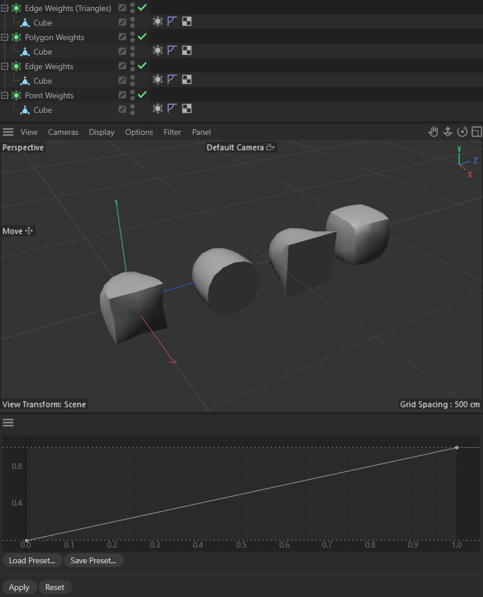

# Py - Tool Finalization Example

Demonstrates a tool finalization workflow at the example of editing SDS weights.

Tool finalization workflow describes the practice of locking onto a snapshot of scene data and then 
letting the user make rolling changes to the scene with viewport feedback. Each change is based on 
the snapshot data, not the data shown in the viewport or scene, so edits do not build on previous
edits but always on the initial data. Unless the user finalizes the changes, e.g., by clicking an 
"Apply" button, changes are not actually applied to the scene, and rolled back to the initial state 
when the user aborts the tool directly or indirectly. This is a common workflow for tools that can 
also be applied to other cases such as modelling.

*Fig.I - Shows the user editing the weights with viewport feedback. When the user changes the active
tag selection without finalizing the changes, the tool rolls back the unfinalized changes before 
locking onto the new selection.*

Open this dialog example by running the command "Py - SDS Weighting Tool (Finalization Logic)" in the 
Commander (Shift + C). The tool tracks the selection of SDS tags in the scene and lets the user 
modify their weights with a spline custom GUI. Editing the spline will always use the base data, 
although we apply and see the final result in the scene. Only when the user clicks the "Apply" 
button, we finalize the changes and update our base data.

#### Subjects

- Working with a snapshots of scene data for rolling changes, including undo handling.
- Tracking scene state changes via core messages.